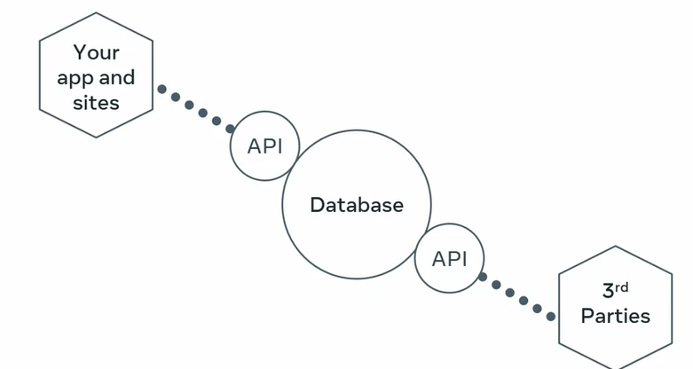
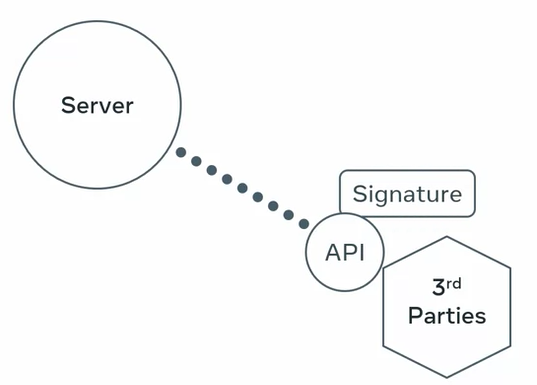

# Security and authentication in REST API
- The core purpose of APIs is to make your data more accessible. Not just for your apps and websites but also for third party clients. This way your data becomes even more useful. **It is crucial to secure APIs***

- But don't forget, because APIs are publicly available, they may pose a risk to your back-end services. Essentially, APIs give third party apps access to your server and database.
- How to keep your API safe and secure ?
- What are the various security concepts and how to implement them in your own APIs ?

## SSL or Secure Soket Layer
- SSL encrypts your data and protect your data when it leaves your browser and the web server. When you set up the SSL certificates properly your APIs can be served over HTTPS.

## Signed URLs
- Signed URLs give a client application limited access to a specific resource for a brief period of time. 
- With a signed URL, every time an API is called, a particular piece of text called a signature is included with the URL.
- Server side code can verify the signature and ensure that the call comes from an authentic source.

