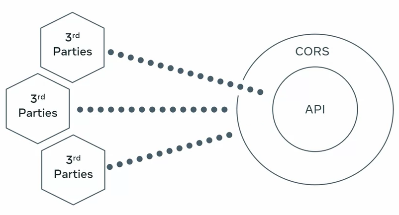
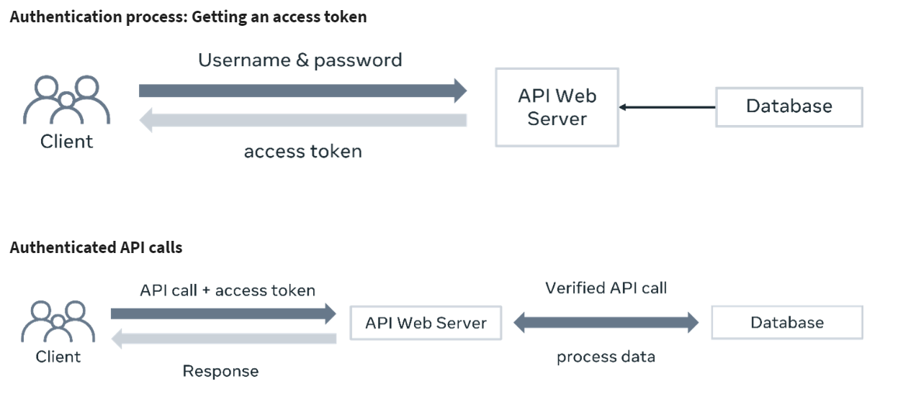
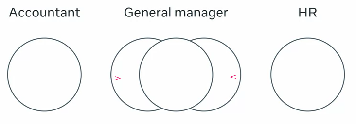
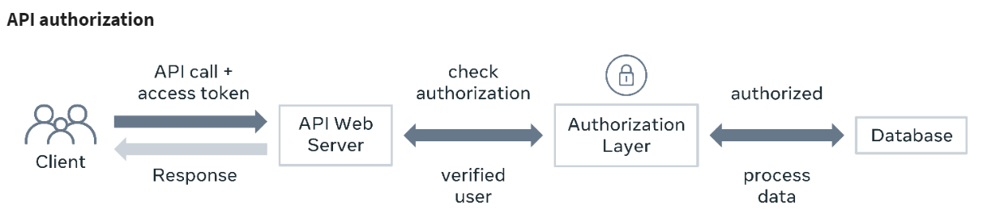

# Security and authentication in REST API
- The core purpose of APIs is to make your data more accessible. Not just for your apps and websites but also for third party clients. This way your data becomes even more useful. **It is crucial to secure APIs***

- But don't forget, because APIs are publicly available, they may pose a risk to your back-end services. Essentially, APIs give third party apps access to your server and database.
- How to keep your API safe and secure ?
- What are the various security concepts and how to implement them in your own APIs ?

## SSL or Secure Soket Layer
- SSL encrypts your data and protect your data when it leaves your browser and the web server. When you set up the SSL certificates properly your APIs can be served over HTTPS.

## Signed URLs
- Signed URLs give a client application limited access to a specific resource for a brief period of time. 
- With a signed URL, every time an API is called, a particular piece of text called a signature is included with the URL.
- Server side code can verify the signature and ensure that the call comes from an authentic source.

- How to include signature ?   
- **HMAK** : For example, some secret message, encoded by a digest algorithm with a secret key, some secret key creates this HMAC signature. 

## Authentification 
> user names and password based authentication ? sending a user name and passwords to every API call is frustrating and it's not secure.
### Token based authentication
- **Basic authentication** : requires users to send their user name and password in every call.
- prefers using token based authentication over HTTP based authentication when securing its API.Because basic authentication requires users to send their user name and password in every call.
- **token-based authentication** : the user sends their user name and password to the sign in URL, and then receives a unique token in text form. After that, every API call will include this token as a HTTP header. The server side code can check the token, extract the information hidden in it and match it with an existing user. After this verification, the rest of the work is performed on behalf of that matching user. **To create this token, you can use an ad hoc policy from the backend framework we're using, or you can use something more industry standard, like JSON Web Token or JWT.**

## HTTP code involved during the authentification process
- There are a couple of popular HTTP codes involved during the authentication process :
- **401** : means unauthorized. In this context, unauthorized means the user name and password don't match. So the server cannot continue further.
- **403** : which means forbidden. This is an interesting code, and it means that your credentials are valid and you have successfully identified yourself, but you don't have the authority to perform the action.

## Cross origin resource sharint CORS & FirewAll
- We can accept calls from everywhere, or by configuring the cores headers, we can only accept calls from some specific domains.

- If you want to ensure that only specific IP addresses can access your API, you can use a firewall application on your server.

# Access control 
> With access control you can specify which users are allowed to access your API. And what data they can see, that way you can be sure that only the people who are supposed to manage your data can access it.
> API design is not complete without effective access control by taking the proper time to design and plan out your privileges and roles. You make life easier for developers and avoid costly debugging and refactoring down the road. A well designed API access control system is an asset for the whole project, it saves time and money in the long run.

## Role
- Roles and privileges are the building blocks of designing and access control system. A role is a collection of privileges and a privilege is if you are allowed to do a particular task. 

## Authorisation
- Authorization is another word for access control
-  Authentication and authorization are two different things. Authentication gets you in and authorization allows you to do something after authentication or prevents you from doing it.
Example :
So your accountants will only have access to accounting features while your HR team will only have access to HR management features. And there's also a manager specific role with relevant privileges, this way you can assign all three roles to the general manager and they will be able to perform every task an accountant HR and a manager can do. And if you assign a new privilege to the accountant role, the general manager will automatically have that privilege added to their role. 

