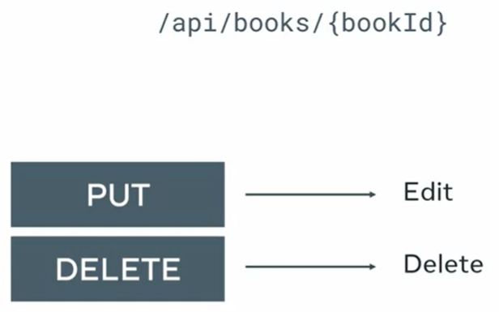

# Book List API project 

> A bookstore contacted you because they need a website and mobile application to streamline the management of their books. 
- From the website and mobile app managers should be able to add and edit books quickly.
- Visitors should be able to browse the available book collection.

## Django models
- To store the books in the database, you need a storage space or table and you need a Django model to manipulate and define how the data will be stored in a table.
- Django models work like a bridge between the data and your business logic.
- We need to create a Django model with the following fields : 
  - Title, which will be a car field with a max length of 255. 
  - Author, which we have the same specs as the title field. 
  - Price, which will be a decimal field with a maximum of five digits and two decimal places.
  - Inventory which is an optional positive small integer field to indicate if a book is in stock or not.
 


## API Endpoints
 - We need two API endpoints to allow users to browse a single book or the whole collection. 

```
/api/books
/api/books/{bookId}
```

/api/books ==> Deliver all the books in your database.
/api/books/{bookId} ==> Will show only a particularly book.


> The results of an API request are usually delivered as JSON or xml data.
- Here is a quick tip for converting a single model to a JSON response :
  - First, import the model to dict function from the Django dot forms dot models module and the JSON response class from the Django dot http module.
```
from django.forms.models import model_to_dict
from django.http import JsonResponse
...
book = Book.objects.get(pk=16)
return JsonResponse(model_to_dict(book))
 ```
### For deleting and editing books
- Fo delete an existing book, you'll send a http DELETE request.
- For deleting and editing, you can create a URL pattern for this endpoint in your Django project as api books, open angle brace colon pk close angle brace.
```
/api/books/<int:pk>
```


### Sample JSON String par payload
Data is passed in http body as :   
- Form URL encoded string
- Raw JSON string

Json payload :
```
{
  "title": "Seawolf"
  "author": "Jack London"
}
```
To parse this string to access these individual data elements. We use the QueryDict class from the Django.http module to parse the request body to a python dictionary. 
```
from django.http import QueryDict
...
request_body = QueryDict(request.body)
title = request_body.get('title')
```
