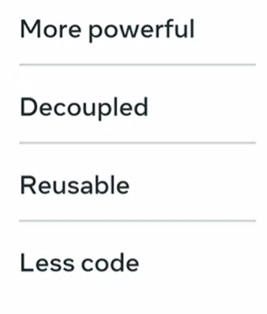

# Organizing an API project

> How to organize an API project with multiple apps ?


## Create multiple apps for different aims
- It's necessary to split a big app into multiple apps to make sure that all your goals are met.
- Splitting a big app into multiple apps means it's as decoupled as possible with each app dealing with a particular set of relevant problems. 
  - Prevent one big app
  - Planning
  - Smaller aims
  - Multiple apps 

### Avoid global environment
- You shouldn't use the global environment for your project dependencies. That's because not every project uses the same version of a package and not every project needs all of them.
- Using the global environment will create conflicts for the packages and create more issues than solutions.
- Always use a virtual environment to avoid such conflicts.
- Use pipnv to isolate the dependencies in a virtual environment for your projects.
By doing this, you avoid any potential conflicts and can ensure that your dependencies are exactly what you need for your project. 

### Upgrades might break apps
- When you upgrade an API, it may break the existing app because the result of the new API might not be the same as the old one.
- For such upgrades, you should always use versioning and keep the old working API intact and launch the updated version so that the developers of the client app have enough time to update their apps to work properly with the new APIs.
- For the newer version, always create a separate app instead of adding everything in the old app because it will be hard to manage over time.

### List your dependencies 
Save your packages and their version numbers in a separate requirements.txt file.

```
pip3 freeze > requirements.txt
```
**With pipnv, things are easier. It uses the piplock file to keep track of dependencies and complex inter-dependencies between the packages.** 

### Separate resource folder for each app
- it's much better to have separate resource folders for each of your apps. That way, you can avoid conflicts and efficiently manage your files when required

### Split setting into multiple settings files
- instead of creating a combined settings file, you may split the relevant settings into separate files and include them all from the main settings.
- Not only does this process prevent a single long file that is hard to edit, it also helps you to manage your settings and easily find the ones you are looking for.
- You can use Django splits settings for this purpose. 

### Place business logic in models
- Instead of putting all the business logic into views, take them to the related models. 

